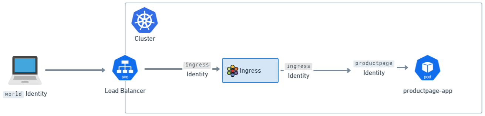

# Cilium Ingress Controller Lab

This lab demonstrates Cilium's native Ingress Controller implementation, showcasing HTTP/HTTPS, gRPC traffic management, and advanced network policy integration.

## Overview

Cilium Ingress Controller provides a CNI-integrated ingress solution that differs from traditional ingress controllers. Traffic flows through Cilium's eBPF datapath and per-node Envoy proxy, enabling deep integration with Cilium Network Policies for advanced security controls.

**Lab Source:**
This lab is adapted from [Isovalent's Cilium Ingress Controller Lab](https://isovalent.com/labs/cilium-ingress-controller/).

## Key Features Demonstrated

- **HTTP/HTTPS Ingress** - Traditional web application routing with TLS termination
- **gRPC Ingress** - Binary protocol support for modern microservices
- **Network Policy Integration** - Ingress-aware security policies
- **Identity-based Filtering** - CIDR and cluster identity-based access control
- **Default-Deny Policies** - Zero-trust security model implementation

## Prerequisites

- Kubernetes cluster with Cilium CNI installed
- Cilium Ingress Controller feature enabled
- kubectl access to the cluster
- mkcert tool for TLS certificate generation
- grpcurl for gRPC testing

## Lab Architecture

Cilium's Ingress differs from traditional controllers:
- **Traditional Ingress**: External → Service → Ingress Pod → Backend
- **Cilium Ingress**: External → eBPF → Envoy (per-node) → Backend

Traffic receives the special `ingress` identity in Cilium's policy engine, enabling policy enforcement at two points:
1. **world → ingress**: Before traffic reaches Envoy
2. **ingress → backend**: After policy lookup by Envoy

---

## Part 1: HTTP Ingress

### Verify Ingress Controller Feature

Verify that Cilium was started with the Ingress Controller feature:
```bash
cilium config view | grep ingress-controller
```

```bash
kubectl apply -f bookinfo.yml
```

```bash
kubectl apply -f basic-ingress.yaml
```


You will see a LoadBalancer service named cilium-ingress-basic-ingress
```bash
kubectl get svc
```

The same external IP address is also associated to the Ingress
```bash
kubectl get ingress
```

Let's retrieve this IP address
```bash
INGRESS_IP=$(kubectl get ingress basic-ingress -o jsonpath='{.status.loadBalancer.ingress[0].ip}')
echo $INGRESS_IP
```

## Make HTTP Request
```bash
curl -so /dev/null -w "%{http_code}\n" http://$INGRESS_IP/
```

From outside the cluster you can also make requests directly to the details service using the path /details (again, you should see a code 200 reply)
```bash
curl -so /dev/null -w "%{http_code}\n" http://$INGRESS_IP/details/1
```

However, you can't directly access other URL paths that weren't defined in basic-ingress.yaml. For example, while you could get JSON data from a request to <address>/details/1, you will get a 404 error if you make a request to <address>/ratings as it is not explicitly mapped in the Ingress resource
```bash
curl -so /dev/null -w "%{http_code}\n" http://$INGRESS_IP/ratings
```
---

## Part 2: gRPC Ingress

### Overview
This section demonstrates gRPC traffic routing using GCP's [microservices demo app](https://github.com/GoogleCloudPlatform/microservices-demo).

### eploy Application

Install the app with the following command:
```bash
kubectl apply -f gcp-microservices-demo.yml
```

Since gRPC is binary-encoded, you also need the proto definitions for the gRPC services in order to make gRPC requests. Download this for the demo app
```bash
curl -o demo.proto https://raw.githubusercontent.com/GoogleCloudPlatform/microservices-demo/main/protos/demo.proto
```

Wait for the application to be fully deployed
```bash
kubectl rollout status -f /opt/gcp-microservices-demo.yml
```

## Deploy the Ingress

You'll find the example Ingress definition in grpc-ingress.yaml
```bash
kubectl apply -f grpc-ingress.yaml
```
This defines paths for requests to be routed to the productcatalogservice and currencyservice microservices

Just as in the HTTP ingress challenge, this creates a LoadBalancer service, which Cilium LB-IPAM will provision in the context of this lab.

Check the Ingress resource to retrieve the load balancer's IP address
```bash
kubectl get ingress
INGRESS_IP=$(kubectl get ingress grpc-ingress -o jsonpath='{.status.loadBalancer.ingress[0].ip}')
```

## Make gRPC Requests

Let's try to access the currency service of the application, which lists the currencies the shopping app supports
```bash
grpcurl -plaintext -proto ./demo.proto $INGRESS_IP:80 hipstershop.CurrencyService/GetSupportedCurrencies
```

Also try accessing the product catalog service with
```bash
grpcurl -plaintext -proto ./demo.proto $INGRESS_IP:80 hipstershop.ProductCatalogService/ListProducts
```
---

## Part 3: TLS Ingress

### Create TLS Certificate and Private Key

For demonstration purposes we will use a TLS certificate signed by a made-up, self-signed certificate authority (CA). One easy way to do this is with mkcert.

Create a certificate that will validate bookinfo.cilium.rocks and hipstershop.cilium.rocks, as these are the host names used in this ingress example

```bash
mkcert '*.cilium.rocks'
```

Mkcert created a key (_wildcard.cilium.rocks-key.pem) and a certificate (_wildcard.cilium.rocks.pem) that we will use for the ingress service.

Create a Kubernetes secret with this key and certificate
```bash
kubectl create secret tls demo-cert \
  --key=_wildcard.cilium.rocks-key.pem \
  --cert=_wildcard.cilium.rocks.pem
```

## Deploy the Ingress

The ingress configuration for this demo provides the same routing as those demos but with the addition of TLS termination:

    - the /hipstershop.CurrencyService prefix will be routed to the currency gRPC service deployed in the gRPC challenge
    - the /details prefix will be routed to the details HTTP service deployed in the HTTP challenge
    - the / prefix will be routed to the productpage HTTP service deployed in the HTTP challenge

These three services will be secured via TLS and accessible on two domain names:

    - bookinfo.cilium.rocks
    - hipstershop.cilium.rocks

Inspect the ingress to verify these rules
```bash
yq tls-ingress.yaml
```

Then deploy the ingress to the cluster
```bash
kubectl apply -f tls-ingress.yaml
```

This creates a LoadBalancer service, which after around 30 seconds or so should be populated with an external IP address.

Verify that the Ingress has an load balancer IP address assigned
```bash
kubectl get ingress tls-ingress
```

Then assign this IP to the INGRESS_IP variable so we can make use of it
```bash
INGRESS_IP=$(kubectl get ingress tls-ingress -o jsonpath='{.status.loadBalancer.ingress[0].ip}')
echo $INGRESS_IP
```

## Edit /etc/hosts
In this ingress configuration, the host names hipstershop.cilium.rocks and bookinfo.cilium.rocks are specified in the path routing rules.

Since we do not have DNS entries for these names, we will modify the /etc/hosts file on the host to manually associate these names to the known ingress IP we retrieved. Execute the following commands
```bash
cat << EOF >> /etc/hosts
${INGRESS_IP} bookinfo.cilium.rocks
${INGRESS_IP} hipstershop.cilium.rocks
EOF
```

## Make Requests

Install the Mkcert CA into your system so cURL can trust it
```bash
mkcert -install
```

Now let's make a request to the ingress
```bash
curl -s https://bookinfo.cilium.rocks/details/1 | jq
```

Similarly you can test a gRPC request
```bash
grpcurl -proto ./demo.proto hipstershop.cilium.rocks:443 hipstershop.ProductCatalogService/ListProducts | jq
```

We can see that our single Ingress resource now allows to access both applications, in a secure manner over HTTPS, using a valid TLS certificate.---

## Part 4: Ingress and Network Policy

### Understanding Cilium Ingress Architecture

#### How Cilium Ingress differs from other Ingress controllers?

One of the biggest differences between Cilium’s Ingress and other Ingress controllers is how closely tied the Ingress implementation is to the CNI.

For Cilium, Ingress is part of the networking stack, and so behaves in a different way to other Ingress controllers, even when they're running in a Cilium cluster.

Other Ingress controllers are generally installed as a Deployment or DaemonSet in the cluster, and exposed via a LoadBalancer Service or similar.

Cilium’s Ingress is exposed with a LoadBalancer or NodePort service, or optionally can be exposed on the Host network as well. But in all of these cases, when traffic arrives at the Service’s port, eBPF code intercepts the traffic and transparently forwards it to Envoy.

#### Cilium’s Ingress config and CiliumNetworkPolicy

Ingress traffic bound to backend services via Cilium passes through a per-node Envoy proxy.

The per-node Envoy proxy has special code that allows it to interact with the eBPF policy engine, and do policy lookups on traffic. This allows Envoy to be a Network Policy enforcement point for Ingress traffic.

However, for ingress config, there’s also an additional step. Traffic that arrives at Envoy for Ingress is assigned the special ingress identity in Cilium’s Policy engine.

Traffic coming from outside the cluster is usually assigned the world identity (unless there are IP CIDR policies in the cluster). This means that there are actually two logical Policy enforcement points in Cilium Ingress - before traffic arrives at the ingress identity, and after, when it is about to exit the per-node Envoy.



This means that, when applying Network Policy to a cluster, it’s important to ensure that both steps are allowed, and that traffic is allowed from world to ingress, and from ingress to identities in the cluster (like the productpage identity in the image above).

### Default network policy

Before we lock down access to our application, let's verify that all the external traffic is allowed (default behaviour) when using the basic Ingress
```bash
curl -so /dev/null -w "%{http_code}\n" http://172.18.255.201/details/1
```
Expect to see a 200 return code.

Let's deploy a policy to block all the traffic originating from outside the cluster. Look at the policy first
```bash
yq external-lockdown.yaml
```

This manifests contains two policies

    - a cluster-wide policy that allows the traffic from endpoints within the cluster and, through "default deny", will deny all traffic originating from outside the cluster.
    - a namespaced policy to allow access to Hubble relay, so we can still observe traffic.


Deploy the policy
```bash
kubectl apply -f external-lockdown.yaml
```

Use the Hubble CLI to observe the traffic linked to the Ingress identity
```bash
hubble observe -f --identity ingress
```

Check the connectivity
```bash
curl --fail -v http://172.18.255.201/details/1
```

Expect to see a 403 Forbidden error code.

In Hubble, expect to see flow logs such as
```shell
Sep 16 13:16:58.132: 172.18.0.1:59868 (ingress) -> default/cilium-ingress-basic-ingress:80 (world) http-request DROPPED (HTTP/1.1 GET http://172.18.255.201/details/1)
Sep 16 13:16:58.132: 172.18.0.1:59868 (ingress) <- default/cilium-ingress-basic-ingress:80 (world) http-response FORWARDED (HTTP/1.1 403 0ms (GET http://172.18.255.201/details/1))
```

### Incluster Traffic
Let’s check if in-cluster traffic to the Ingress endpoint is still allowed.

Deploy an internal test application and wait until it's ready
```bash
kubectl apply -f test-application.yaml
kubectl rollout status -f test-application.yaml
```

Now, test that the application can reach the ingress endpoint
```bash
kubectl exec -it deployment/client -- curl -s http://172.18.255.201/details/1
```

Expect to see an output such as
```shell
{"id":1,"author":"William Shakespeare","year":1595,"type":"paperback","pages":200,"publisher":"PublisherA","language":"English","ISBN-10":"1234567890","ISBN-13":"123-1234567890"}%
```

Traffic is still forwarded between pods in the cluster!

### IP Address Filtering

Another common use case is to allow only a specific set of IP addresses to access the Ingress.

Check if we can access the Ingress from your host
```bash
curl -so /dev/null -w "%{http_code}\n" http://172.18.255.201/details/1
```

You should get a 403 response, since access from outside the cluster is not allowed at this point.

Let's fix this via the below policy:
```bash
yq allow-ingress-cidr.yaml
yq allow-ingress-cluster.yaml
```

Let's edit the policy with the IP address of our host. Replace A.B.C.D with your IP address.

Deploy the network policy
```bash
kubectl apply -f allow-ingress-cidr.yaml
kubectl apply -f allow-ingress-cluster.yaml
```

```bash
curl -so /dev/null -w "%{http_code}\n" http://172.18.255.201/details/1
```
Expect to see a successful output (200).

##### Default Deny Ingress Policy

Let’s apply a CiliumClusterwideNetworkPolicy to deny all traffic by default.

```bash
yq default-deny.yaml
```

Like the external-lockdown policy we saw earlier, this policy is cluster-wide and not bound to a namespace. It will block all the traffic (except internal and DNS) by default.

```bash
kubectl apply -f default-deny.yaml
```

With this policy applied, the namespaces are now secured (except for kube-system, which would have to be treated separately).

```bash
curl --fail -v http://172.18.255.201/details/1
```
The request should still work.

Now, check that in-cluster traffic to the same endpoint is also allowed
```bash
kubectl exec -it deployment/client -- curl --fail -v http://172.18.255.201/details/1
```
---

## Part 5: Migrate Ingress to Gateway API

### Overview

This section demonstrates migrating from Ingress API to Gateway API using the `ingress2gateway` tool. Gateway API provides a more expressive and extensible API for configuring ingress traffic.

**Migration Methods:**
- **Manual**: Manually creating Gateway API resources based on existing Ingress resources
- **Automated**: Using the `ingress2gateway` tool to automatically convert Ingress to Gateway API

### Step 1: Install Ingress2Gateway Tool

Download and install the ingress2gateway tool:
```bash
wget https://github.com/kubernetes-sigs/ingress2gateway/releases/download/v0.4.0/ingress2gateway_Linux_x86_64.tar.gz
tar -xvzf ingress2gateway_Linux_x86_64.tar.gz
```

Verify the binary can be executed:
```bash
./ingress2gateway help
```

### Step 2: Generate Gateway API Manifests

Use the Cilium provider to translate existing Ingress resources:
```bash
./ingress2gateway print --providers=cilium
```

The output shows how Gateway API dissociates the Ingress definition from HTTP routes:
- **Gateway manifest** - Defines the ingress gateway
- **HTTPRoute manifests** - Define routing rules (replaces Ingress path rules)

Note the `gateway.networking.k8s.io/generator` annotation indicating auto-generated configuration.

Save the generated configuration:
```bash
./ingress2gateway print --providers=cilium > ingress2gateway.yaml
```

### Step 3: Install Gateway API CRDs

Install the required Gateway API v1.2.0 CRDs:
```bash
kubectl apply -f https://raw.githubusercontent.com/kubernetes-sigs/gateway-api/v1.2.0/config/crd/standard/gateway.networking.k8s.io_gatewayclasses.yaml
kubectl apply -f https://raw.githubusercontent.com/kubernetes-sigs/gateway-api/v1.2.0/config/crd/standard/gateway.networking.k8s.io_gateways.yaml
kubectl apply -f https://raw.githubusercontent.com/kubernetes-sigs/gateway-api/v1.2.0/config/crd/standard/gateway.networking.k8s.io_httproutes.yaml
kubectl apply -f https://raw.githubusercontent.com/kubernetes-sigs/gateway-api/v1.2.0/config/crd/standard/gateway.networking.k8s.io_referencegrants.yaml
kubectl apply -f https://raw.githubusercontent.com/kubernetes-sigs/gateway-api/v1.2.0/config/crd/standard/gateway.networking.k8s.io_grpcroutes.yaml
kubectl apply -f https://raw.githubusercontent.com/kubernetes-sigs/gateway-api/v1.2.0/config/crd/experimental/gateway.networking.k8s.io_tlsroutes.yaml
```

### Step 4: Enable Gateway API in Cilium

Upgrade Cilium and enable Gateway API feature:
```bash
cilium upgrade \
  --version 1.18.2 \
  --reuse-values \
  --set gatewayAPI.enabled=true
cilium status --wait
```

Verify that Gateway API is enabled:
```bash
cilium config view | grep enable-gateway-api
```

Restart the Cilium Operator to manage Gateways:
```bash
kubectl -n kube-system rollout restart deployment cilium-operator
```

### Step 5: Deploy Gateway API Configuration

Deploy the configuration generated by Ingress2Gateway:
```bash
kubectl apply -f ingress2gateway.yaml
```

Verify the LoadBalancer service was created:
```bash
kubectl get svc cilium-gateway-cilium
```

Check the Gateway has an external IP assigned:
```bash
kubectl get gateway cilium
```

Retrieve the Gateway IP address:
```bash
GATEWAY=$(kubectl get gateway cilium -o jsonpath='{.status.addresses[0].value}')
echo $GATEWAY
```

### Step 6: Update DNS Configuration

Update the hosts file to point to the new Gateway IP address. Replace the IP for `bookinfo.cilium.rocks` and `hipstershop.cilium.rocks` with the Gateway's IP.

### Step 7: Verify Connectivity

Test HTTPS request to the Gateway:
```bash
curl -s https://bookinfo.cilium.rocks/details/1 | jq
```

Test gRPC request:
```bash
grpcurl -proto ./demo.proto hipstershop.cilium.rocks:443 hipstershop.ProductCatalogService/ListProducts | jq
```

### Step 8: Clean Up Legacy Ingress

Once verified, remove the old Ingress resources:
```bash
kubectl delete ingress --all
```

---

## Summary

This lab demonstrated Cilium's Ingress Controller capabilities including:
- HTTP/HTTPS and gRPC traffic routing
- TLS certificate management
- Network policy integration with ingress identity
- CIDR-based access control
- Migration from Ingress API to Gateway API

The key advantage of Cilium Ingress is its deep integration with the CNI, enabling advanced security features through eBPF-based policy enforcement at multiple points in the traffic path.